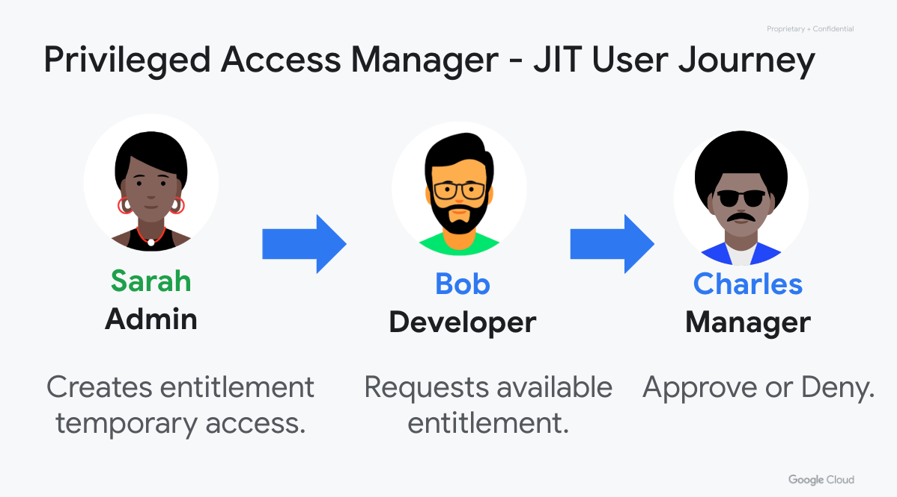

# Cloud Privileged Access Manager (PAM) Module
Privileged Access Manager (PAM) is a Google Cloud native, managed solution to secure, manage and audit privileged access while ensuring operational velocity and developer productivity. PAM enables just-in-time, time-bound, approval-based access elevations, and auditing of privileged access elevations and activity. PAM lets you define the rules of who can access, what they can access, and if they should be granted access with or without approvals based on the sensitivity of the access and emergency of the situation. This module makes it easy to set up [Privileged Access Manager](https://https://cloud.google.com/iam/docs/pam-overview).

# How Privileged Access Manager (PAM) works:
- Create an Entitlement.
- Request a Grant against an Entitlement. 
- Approve or reject a request for a Grant against an Entitlement. 



##  Usage

```tf
# Configure Cloud Privilege Access Management (PAM)
module "iam-pam" {
  source  = "GoogleCloudPlatform/pam/google"
  version = "1.1.1"
  #source                         = "../../"
  pam_at_org_id                  = false       ## Optional, only one should be true for PAM level (Org_id or folder_id or project_id)
  pam_at_folder                  = false       ## Optional, only one should be true for PAM level (Org_id or folder_id or project_id)
  pam_at_project                 = true        ## Optional, only one should be true for PAM level (Org_id or folder_id or project_id)
  organization_id                = "XXXXXXXX"  ## Required for PAM service account premission
  billing_project_id             = "XXXXXXXXX" ## Required for API billing quota if setting PAM at org level or folder level
  folder_id                      = ""          ## Optional, only needed for PAM at Folder level
  project_id                     = ""          ## Optional, only needed for PAM at Project level
  eligible_users                 = ["user:foo@example.com"]
  eligible_approvers             = ["user:bar@example.com"]
  role                           = "roles/storage.admin"
  role_condition                 = "request.time < timestamp(\"2024-12-31T19:30:00.000Z\")"
  justification_not_mandatory    = false # The justification is not mandatory but can be provided in any of the supported formats.
  justification_unstructured     = true  # The requester has to provide a justification in the form of free flowing text.
  max_request_duration           = "28800s"
  location                       = "global" #only global is supported currently
  entitlement_id                 = "pam-entitlement-poc"
  require_approver_justification = true
  approver_email_recipients      = ["approver2@example.com"] ## additional users  for notification
  admin_email_recipients         = ["admin@example.com"]     ## additional users for notification
  requester_email_recipients     = ["requestor@example.com"] ## additional users for notification
}

```

<!-- BEGINNING OF PRE-COMMIT-TERRAFORM DOCS HOOK -->
## Inputs

| Name | Description | Type | Default | Required |
|------|-------------|------|---------|:--------:|
| entitlement\_approval\_notification\_recipients | List of email addresses to be notified when a request is granted | `list(string)` | `[]` | no |
| entitlement\_approvers | Required List of users, groups or domain who can approve this entitlement. Can be one or more of Google Account email, Google Group or Google Workspace domain | `list(string)` | n/a | yes |
| entitlement\_availability\_notification\_recipients | List of email addresses to be notified when a entitlement is created. These email addresses will receive an email about availability of the entitlement | `list(string)` | `[]` | no |
| entitlement\_id | The ID to use for this Entitlement. This will become the last part of the resource name. This value should be 4-63 characters. This value should be unique among all other Entitlements under the specified parent | `string` | n/a | yes |
| entitlement\_requesters | Required List of users, groups, service accounts or domains who can request grants using this entitlement. Can be one or more of Google Account email, Google Group, Service account or Google Workspace domain | `list(string)` | n/a | yes |
| grant\_service\_agent\_permissions | Whether or not to grant roles/privilegedaccessmanager.serviceAgent role to PAM service account | `bool` | `false` | no |
| location | The region of the Entitlement resource | `string` | `"global"` | no |
| max\_request\_duration\_hours | The maximum amount of time for which access would be granted for a request. A requester can choose to ask for access for less than this duration but never more | `number` | `1` | no |
| organization\_id | Organization id | `string` | n/a | yes |
| parent\_id | The ID of organization, folder, or project to create the entitlement in | `string` | n/a | yes |
| parent\_type | Parent type. Can be organization, folder, or project to create the entitlement in | `string` | n/a | yes |
| requester\_justification | If the requester is required to provide a justification | `bool` | `true` | no |
| require\_approver\_justification | Do the approvers need to provide a justification for their actions | `bool` | `true` | no |
| role\_bindings | The maximum amount of time for which access would be granted for a request. A requester can choose to ask for access for less than this duration but never more | <pre>list(object({<br>    role                 = string<br>    condition_expression = optional(string)<br>  }))</pre> | n/a | yes |

## Outputs

| Name | Description |
|------|-------------|
| entitlement | Entitlement created |

<!-- END OF PRE-COMMIT-TERRAFORM DOCS HOOK -->

## Requirements

These sections describe requirements for using this module.

### Software

The following dependencies must be available:

- [Terraform][terraform] v1.3
- [Terraform Provider for GCP][terraform-provider-gcp] plugin v3.53

### Service Account and User Permissions

A service account with the following roles must be used to provision
the resources of this module:

- PAM Service Agent : `roles/privilegedaccessmanager.serviceAgent`


The [Project Factory module][project-factory-module] and the
[IAM module][iam-module] may be used in combination to provision a
service account with the necessary roles applied.

### APIs

A project with the following APIs enabled must be used to host the
resources of this module:

- Cloud API: `privilegedaccessmanager.googleapis.com`

The [Project Factory module][project-factory-module] can be used to
provision a project with the necessary APIs enabled.

## Contributing

Refer to the [contribution guidelines](./CONTRIBUTING.md) for
information on contributing to this module.
